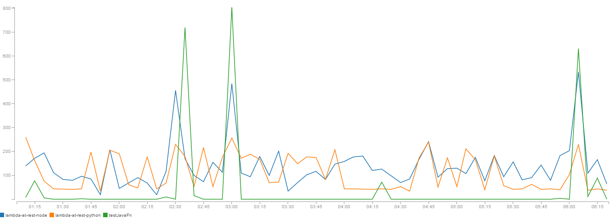

AWS Lambda cold start (pseudo-)benchmark
==============================================================================

**tl;dr** Python starts fastest (numbers below are for 100 invocations):

    ==> java.run <==

    real	0m8.461s
    user	0m6.365s
    sys	    0m1.783s

    ==> nodejs.run <==

    real	0m4.205s
    user	0m3.043s
    sys	    0m1.184s

    ==> python.run <==

    real    0m1.457s
    user    0m0.901s
    sys     0m0.531s

## Methodology

Dummy (w/o "Hello world") programs were executed on Ubuntu 14.04.3 LTS inside
Virtualbox using the following commands. For Python 2.7.6:

    cd python
    time (for i in $(seq 100); do python main.py; done) > ../python.run 2>&1

For Oracle Java 1.8.0_72:

    cd java
    javac main.java
    time (for i in $(seq 100); do java Main; done) > ../java.run 2>&1

For Node.js 0.10.25:

    cd nodejs/
    time (for i in $(seq 100); do nodejs main; done) > ../nodejs.run 2>&1

For memory, the measurement was done even more naively ([/usr/bin/time
trick](http://stackoverflow.com/questions/774556/peak-memory-usage-of-a-linux-unix-process)):

    /usr/bin/time -v python main.py
            ...
            Maximum resident set size (kbytes): 4940
            ...

    /usr/bin/time -v java Main
            ...
            Maximum resident set size (kbytes): 18388
            ...

    /usr/bin/time -v nodejs main
            ...
            Maximum resident set size (kbytes): 8776
            ...

Results were concatenated using the following command
([credit](http://stackoverflow.com/questions/5917413/cat-multiple-files-but-include-filename-as-headers)):

    tail -n +1 *.run

Better (more representative) and/or more extensive (include native process
invocation time and test C/C++/Go) measurements are more than welcome via pull
requests!

## Impact

Okay, numbers seem to be within the same order of magnitude, so the question is
how does it look when converted to $$$?

1. Memory has little or no effect as it is provisioned in chunks of 64MB, thus
making the differences in startup memory consuption negligible.
2. Startup time also has *limited* impact on the billing, as it is rounded up
to the nearest 100ms.
3. We can calculate, how much would it take to call 1MM functions if they were
billed without run time rounding.

Base cost for 1MM function calls taking 128MB RAM and running for 1ms:

base = 1000000 * $0.00001667 / 1000 / 1024 * 128 = $0.00208375

I will calculate the cost for 1MM calls according to:

- 20ms startup time for Python ~ $0.041675
- 40ms startup time for Node.js ~ $0.08335
- 80ms startup time for Java ~ $0.1667

Additionally, every 1MM requests will incur in $0.20 charge by AWS. Taking into
account that it looks negligible when compared to actual runtime costs, I think
it's pretty safe to optimise function performance (or choose the runtime
accordingly) instead of focusing on startup time unless you run into additional
100ms cost every function call.

*Also, 1MM API Gateway requests would cost you $3.50, which means that this
comparison is virtually useless if you're working on a dirt cheap API backend.*

## C & Go comparison just for fun

    ==> output/c.run <==

    real    0m0.040s
    user    0m0.007s
    sys 0m0.000s

    ==> output/go.run <==

    real    0m0.081s
    user    0m0.003s
    sys 0m0.007s

## CloudWatch stats for sample microservices deployed (Python & Node.js)

Java wins by an order of magnitude when in hot mode, has worst case cold start
times roughly 4 times of Python. I attribute this with the size of the code 
bundle (after a few iterations, the jar file exploded to 6MB).

On AWS, I used standard "blueprints" for Node.js and Python (I did move dynamodb
initialization out of the handler in Python code though). This is my attempt
to mimic their code in Java: https://github.com/berezovskyi/lambda-test-java

